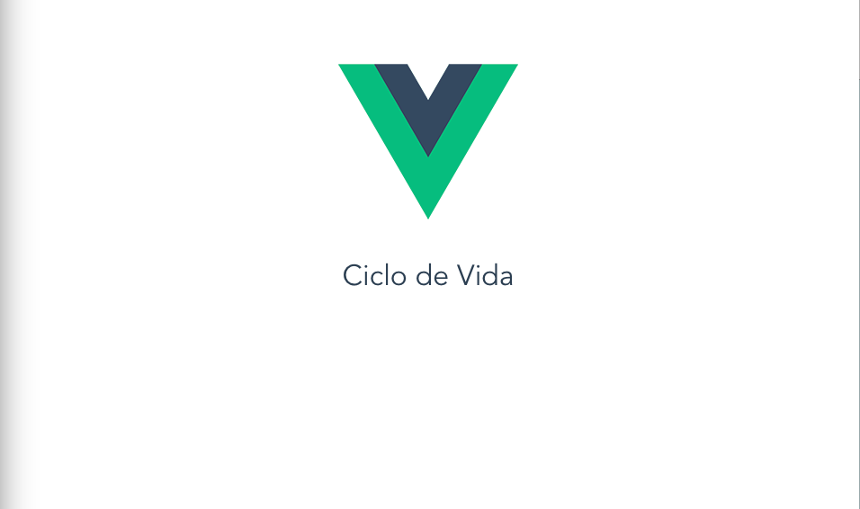

# Ejemplos Curso Vue.js Profesional

> 👩‍🏫 Ejemplos del Curso de Vue.js Profesional

## Video 24 - Ciclo de Vida



## Instalacion

``` bash
# instalar dependencias
npm install

# servir aplicacion para desarrollo en localhost:8080
npm run dev

# compilar aplicacion para distribuir en produccion
npm run build
```
